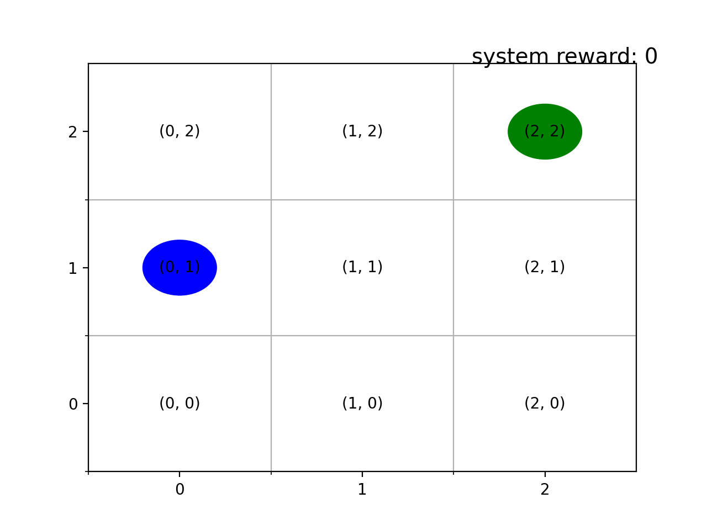
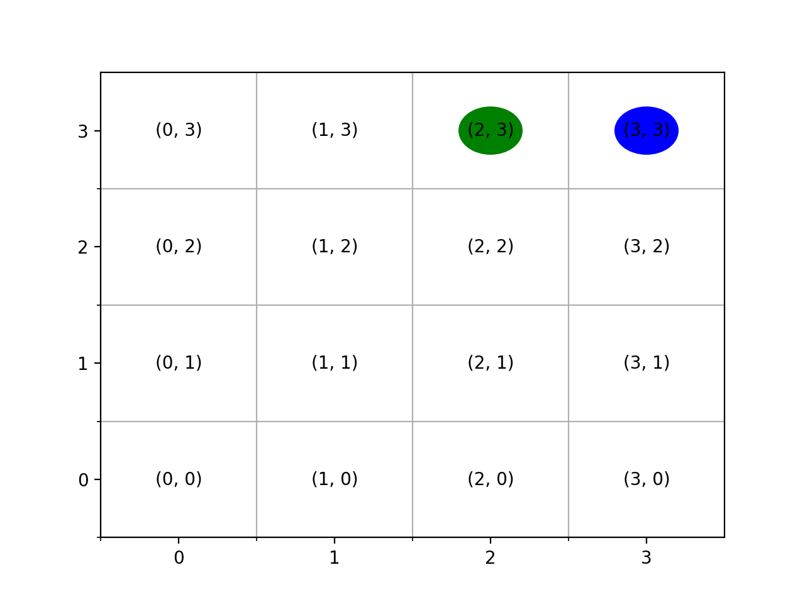

# Project Description 

This is a repo for the deep learning course project  : Correct-by-synthesis reinforcement learning with temporal logic constraints [1](https://github.com/MuvvalaKaran/CoRL/blob/master/README.md#reference).

More information regarding the course can be found [here](https://sites.google.com/colorado.edu/csci-5922-spring-2020)

The main aim of this project is implementation and evaluating the results for the examples discussed by the authors in the paper. 

**Table of Contents**
* [Installation Guide](https://github.com/MuvvalaKaran/CoRL/blob/master/README.md#instructions-to-run)
* [Project Description](https://github.com/MuvvalaKaran/CoRL/blob/master/README.md#about-the-project)

# Instructions to run 

Follow these three steps to succesffully install and run the project. 

## Installing the env 

Install anaconda on your OS and then run the below mentioned shell commands with conda comand path

* Install dependencies - Install conda env

Use the terminal or an Anaconda Prompt for the following steps:

* Create the environment from the environment.yml file under conda/

    ```bash
    conda env create -f CoRL_env.yml
    ```

* The first line of the yml file sets the new environment's name. In my case it is `dl_project_env`. You could modify it before compiling this file.

* Activate the new environment: note replace myenv with "dl_project_env" 

    ```bash
    conda activate myenv
    ```

* Verify that the new environment was installed correctly. You should see a star('\*') in front the current active env

    ```bash
    conda env list
    ```

* You can also use 
    
    ```bash
    conda info --envs
    ```
* Make a `frames` folder within the `src` folder. This folder is used to save the frames used to create a gif in the code.

## Make Slugs executable

* Finally, you need create the `slugs` executable. cd into the src folder in `slugs` and run the `make`. `ls` to ensure that the executable exists. 

## Running the code

cd into the src/ folder and type 

```python3 main.py <save_flag> <grid_size>```

For convenience I would recommend using `save_flag = True` and the value of `grid_size(N) = 4 - 7`.

# Directory Hierarchy

```bash
├── conda # contains the environment file necessary to reproduce the python env
│   └── CoRL_env.yml
├── lib # contains the source code for slugs tool
│	├── README.md
│	└── slugs
├── README.md
└── src # containts all the code relevant to the project
    ├── figures_and_gifs # directory containing all the saved gifs for Example 1. and Example 2 (refer to the project report).
    ├── frames # required to store frames. Need to make (using mkdir) one before running the main.py module
    ├── learning_reward_function # source code containing various player, learning algothing and the rl env.
    ├── main.py # main file
    ├── results # directory to dump the run time stats
    ├── saved_players # binary files of learned player 
    └── two_player_game # source code relevant to construction of two-player game
    	└── plots # directory containing all the high resolution plots of policy, Q plot, Valid transitions, max V change while learning


```

# About the project

## Introduction 

Autonomous systems are gradually becoming ubiquitous. Beyond simply
demonstrating these systems, it is becoming increasingly important to provide guarantees that they behave safely and reliably. We can leverage
methods developed from the Formal methods community to synthesize controllers/strategies to achieve a given task with task critical safety and performance guarantees. Traditional open-loop synthesis may work well in static
environments but they may fail to find strategies that guarantee task completion under uncertain or adversarial behavior of the environment. Reactive synthesis is the field that deals with systems that continuously interact
with the environment they operate in. These interactions have novel constraints such as real-time constraints, concurrency, parallelism that make
them difficult to model correctly. We can model the interaction between the
system(robot in our case) and the environment as a two player game and
synthesize a winning strategy that satisfies the given specification formulated
within a fragment of temporal logic framework. Thus we can synthesize controllers that guarantee completion of the task using Formal methods. We
can then employ reinforcement learning techniques to learn to achieve the
given task optimally by learning the underlying unknown reward function.
Thus we establish both correctness (with respect to the temporal logic specifications) and optimality (with respect to the a priori unknown performance
criterion) in regards to the task in a stochastic environment for a fragment
of temporal logic specification. Hence, we can guarantee both qualitative
(encoded as the winning condition) and quantitative (optimal reactive controllers) performance for a system operating in an unknown environment.

## Proposed approach 

This project can be decoupled into two major sub-problems : 

- Compute a set of permissive (winning) strategies that are realizable for a given game
- Choose a strategy that maximizes the underlying unknow reward function using maximin-Q learning algorithm.

## RESULTS

Task : The system robot (green) should always be in a cell diagonally opposite to the env robot


----

----

----

----


## Conclusion

Please refer to [project_report](https://github.com/MuvvalaKaran/CoRL/tree/master/project_report) directory for the presentation and the paper report for this project. Please contact me if you have questions at :karan.muvvala@colorado.edu

## Reference 

> [1]: Min Wen, Rüdiger Ehlers, and Ufuk Topcu. “Correct-by-synthesis reinforcement learning with  temporal logic constraints”. In: 2015 IEEE/RSJ International Conference on Intelligent Robots and Systems (IROS). IEEE. 2015, pp. 4983–4990.